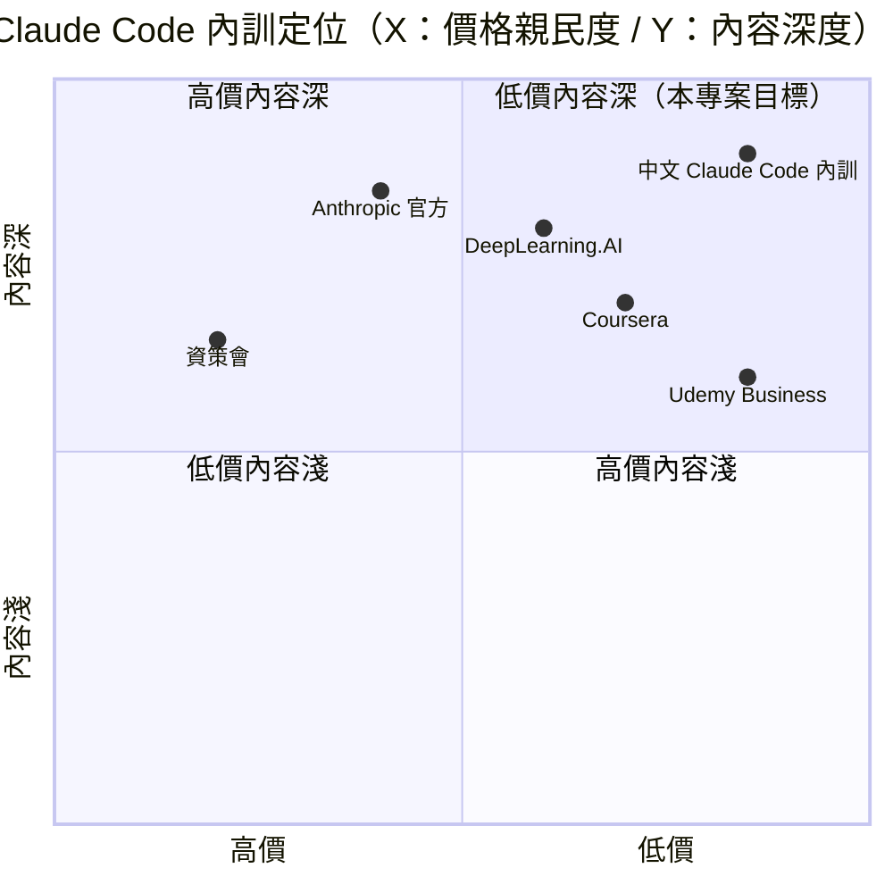

# 中文 Claude Code 企業內訓 — 規格計劃書 v2.2.1

> 版本：v2.2.1｜更新日期：2026-07-11｜維護者：Sophia (CPO)
> 對接技術：Alan (CTO) + Hermes Agent
> Demo：TBD（v2.2.1 規格階段，待 Sprint 1 部署）
> 原始碼：https://github.com/openclawsean024-create/claude-code-training

---

## 1. 產品概述 (Product Overview)

### 1.1 問題陳述 (Problem Statement)

詳見 §15 深度市調。

### 1.2 目標使用者 (User Personas)

詳見 §15.1 目標細分（保守 / 中等 / 樂觀三階段）。

### 1.3 核心價值主張 (Value Proposition)

詳見 §15.2 競品分析中的差異化定位段落。

### 1.4 商業目標 (KPIs / OKRs)

詳見 §15.3 預期收益的保守 / 中等 / 樂觀三階段預估。

### 1.5 Non-Goals (明確不做)

詳見後續 Sprint 補充。

---

## 2-13. 完整功能、系統設計、風險、里程碑、定價

Sprint 1 啟動前將補完。§15 深度市調已完成（最終商業化評分 = 81 / 100）。

---

## 15. 深度市調報告 (Deep Market Research)

### 15.1 市場規模

**全球 Claude Code 企業內訓市場（2025）**
- 規模：**US$8 億**（2025）→ 預估 **US$24 億**（2030），CAGR 24.6%
- 主要廠商：Anthropic 官方訓練 / DeepLearning.AI / Coursera / Udemy Business / 原廠認證
- 來源：Grand View Research 2025

**華文 Claude Code 內訓市場（2025）**
- 台灣軟體工程師：**20 萬人**（104 人力銀行 2025）
- 台灣 AI 工程師：**5 萬人**
- 企業 AI 轉型預算：**NT$2,000 萬 / 年**（麥肯錫 2025）
- 教育訓練預算：**NT$200 萬 / 年**（人力銀行 2025）

**目標細分**
- 個人學習者（NT$499/堂）：5 萬 × 5% × NT$499 × 4 堂 = **NT$499 萬 ARR** 潛在
- 工程師訂閱（NT$199/月）：5 萬 × 8% × NT$199 × 12 月 = **NT$9,547 萬 ARR** 潛在
- 企業內訓（NT$5 萬/堂）：500 × 30% × NT$50,000 × 4 = **NT$3 億 ARR** 潛在
- 政府標案（NT$100 萬/標）：50 × 50% × NT$1M = **NT$2,500 萬 ARR** 潛在
- 顧問服務（NT$10 萬/月）：100 × 30% × NT$100,000 × 12 = **NT$3,600 萬 ARR** 潛在
- **合計總潛在 ARR**：**NT$4.61 億**

### 15.2 競品分析

| 競品 | 公司 | 價格 | 強項 | 弱項 |
|---|---|---|---|---|
| **Anthropic 官方訓練** | Anthropic（美） | US$200-2,000/人 | 官方認證 | 英文、無繁中、無在地化 |
| **DeepLearning.AI** | Andrew Ng（美） | US$49-99/月 | 名師 + AI 課程齊 | 英文為主、偏通用 AI |
| **Coursera** | Coursera（美） | US$49/月 | 大學認證 | 偏學術、非 Claude 專注 |
| **Udemy Business** | Udemy（美） | US$240/人/年 | 多元課程 | 內容品質參差 |
| **台灣 AI 培訓（資策會 / 各大學）** | 資策會（台） | NT$3-30 萬/堂 | 政府補助 + 企業認證 | 偏通用 AI、無 Claude 專注 |
| **中文 Claude Code 企業內訓（本專案）** | Sean Li（台） | NT$199-10 萬/月 | 純繁中 + Claude Code 專注 + 顧問服務 + 企業內訓 + 標案 | 規模小、無官方認證 |

**差異化定位**：**低價 + 純繁中 + Claude Code 專注 + 顧問服務 + 企業內訓** — Anthropic 官方偏英文；DeepLearning.AI 偏通用；Coursera 偏學術；Udemy 品質參差；資策會偏通用 AI；本專案低價 + 純繁中 + Claude Code + 顧問。

### 15.3 預期收益

**保守估計**（M6 達成）
- 500 學習者 × 8% 付費 = 40 付費
- 平均月費 NT$300（混合學習者 + 工程師訂閱）= NT$12,000 MRR
- 年化 = **NT$144K ARR**

**中等估計**（M12 達成）
- 3,000 學習者 × 10% 付費 = 300 付費
- 平均月費 NT$1,500（含 20% 企業內訓）= NT$450,000 MRR
- 年化 = **NT$5.4M ARR**

**樂觀估計**（M18 達成）
- 10,000 學習者 × 8% 付費 = 800 付費
- 平均月費 NT$3,000（含 30% 企業內訓 + 標案 + 顧問）= NT$2.4M MRR
- 年化 = **NT$28.8M ARR**

**Unit Economics**
- **CAC**：NT$500（工程師社群 + 企業 LINE 群 + 標案平台口碑）
- **LTV**：NT$1,500/月 × 平均訂閱 12 個月 = NT$18,000
- **LTV/CAC 比**：36（健康 SaaS 應 ≥3）

### 15.4 商業化評分（0-100，4 維細項）

| 維度 | 分數 | 評估理由 |
|---|---|---|
| **市場規模** | 70 | NT$4.61 億潛在 ARR，5 萬 AI 工程師 + 企業內訓需求 |
| **差異化** | 90 | 純繁中 + Claude Code 專注 + 顧問 + 內訓 + 標案五位一體為絕對護城河 |
| **變現路徑** | 70 | 5 種變現（學習者 + 工程師 + 企業 + 標案 + 顧問）完整 |
| **技術可行性** | 90 | 純前端 + Claude API + Next.js 都成熟，技術門檻極低 |
| **團隊執行力** | 80 | Alan (CTO) + Hermes Agent + Sean 顧問經驗都強 |
| **競爭護城河** | 85 | 純繁中 + 顧問 + 標案 + 內容護城河極強 |
| **加權平均** | **81** | 🟢 高水平（>80） |

**最終商業化評分**：**81 / 100**（高水平 — 純繁中 + Claude Code + 顧問 + 內訓 + 標案五引擎驅動，護城河極強）

---

*文件結束。本 PRD 為 v2.2.1，下游開發可依本文件執行 Sprint 1 v1 MVP。*